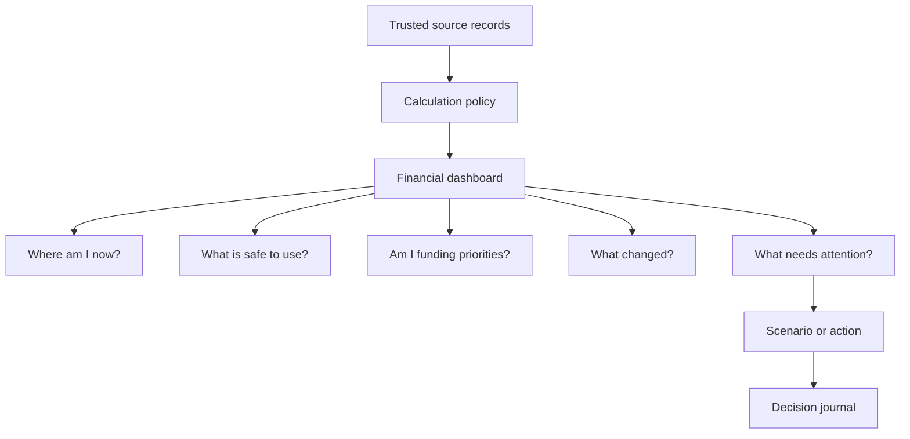

# Personal Finance OS — Trust, Dashboard, and Product Improvement Plan

**Status:** proposed implementation plan  
**Scope:** private, single-user Laravel MVP first; hosted/multi-user product second

## Executive decision

The product direction is strong: it is a purpose-first financial workspace, not another expense tracker. Its best promise is:

> A private, explainable workspace that shows what you own, what it is reserved for, and whether a decision fits your rules.

It is suitable to begin entering real data **only after the Phase 0 corrections below are released and the demo records are removed**. Until then, use it for exploration, not for a purchase, debt, or investment decision. The largest risk is false confidence: several cards use numbers that look precise but are either too broad, duplicated, or not historical.

The immediate goal is not more dashboard widgets. It is a dashboard whose figures can be explained, traced to a source, and safely acted on.

## Review of the earlier assessment

The earlier review is substantially correct. The following points were confirmed in the current code:

- Liquid assets include every asset where `is_liquid` is true, even those classified as `longer_term`; the purchase planner uses that same total. See [FinanceService.php](../app/Services/FinanceService.php).
- Emergency funding uses bucket allocations without checking whether the allocated asset is accessible quickly enough.
- The scenario page displays a **Monthly savings after purchase** input but never uses it. Its frontend math also does not cap a financing down payment at the price, unlike the backend service.
- The cash-flow route redirects to monthly review, leaving the otherwise implemented cash-flow controller and page unreachable. The fallback calculation can double-count obligation amounts.
- Asset, bucket, and goal editing is incomplete in the UI. Goal deletion leaves the associated dedicated bucket because the database nulls the foreign key.
- The allocation target is hard-coded, currency exposure mixes currencies and non-currency assets, and the savings-rate label uses invested amount rather than savings/free cash flow.
- Flash success and validation errors are not shared/displayed consistently, so a user may not know why a save failed.
- Finance tables have no owner, routes are public, and MCP is appropriate only for local use.
- The example MCP command uses the wrong `artisan` path.

One item has changed since that review: the current dirty working tree passes Pint, PHPStan, Pest (7 tests), ESLint, TypeScript, and the production Vite build. Do not add “fix ESLint” to the new backlog unless a later change reintroduces a failure.

## Additional findings from this audit

### P0 — correctness and record-integrity risks

| Finding | Why it matters | Required correction |
|---|---|---|
| A snapshot saved with an earlier `as_of` date is calculated from today's assets and current dashboard data. | It can manufacture a false historical trend and distort performance conclusions. | Only allow a snapshot for today, or rebuild historical snapshots from dated valuation and transaction records. Label existing snapshots as manual checkpoints until then. |
| The MCP/server accepts an `as_of` date in some calls, but assets, liabilities, buckets, commitments, and review selection are mostly current-state data. | An assistant can believe it is analysing a past state when it is not. | Remove unsupported `as_of` inputs or implement a true as-of ledger/valuation query. Never silently mix dates. |
| “Unallocated” assets are calculated by subtracting only goal-bucket allocations. Cash placed in Emergency, Opportunity, or Monthly Spending is therefore described as unassigned. | It creates misleading insight text and may push the user to over-allocate money. | Report three separate totals: allocated to goals, allocated to non-goal purposes, and genuinely unallocated. |
| Financial values are cast to PHP floats for aggregation and calculation. | Binary floating point can produce inaccurate cents and compounded calculation differences. | Aggregate stored monetary values as DECIMAL/string values; round only at defined calculation boundaries and display boundaries. Add rounding tests. |
| Asset values have no dated valuation history, and an asset update overwrites the current value. | The app cannot distinguish contributions from market gains/losses or reconstruct a reliable historical position. | Add valuation entries (asset, valued-on, value in EGP, source, notes) and preserve an auditable current-value projection. |
| Important controlled fields are free text (`asset.type`, `liquidity`, statuses/categories in several models). | Typographical variations fragment allocation, liquidity, and reporting. | Use validated enums/reference lists, a migration path for existing values, and a visible “other” path where needed. |
| Goal creation/deletion and allocation-plan replacement involve multiple writes without a database transaction. | A failure in the middle can leave orphaned or incomplete financial records. | Wrap coupled writes in `DB::transaction()`; define explicit goal completion, pause, and archive behaviour. |

### P1 — decision quality and usability gaps

- The dashboard calls a current net-worth point “investable net worth” in its latest trend entry, even though goal reservations are excluded in the summary. The trend is internally inconsistent.
- A goal can be marked “on track” using all free cash flow for every active goal. Several goals can therefore all appear on track even when their combined required contributions exceed available cash flow.
- The purchase model checks only the price/down payment and finance payment. It needs recurring ownership costs, one-time costs, available cash by liquidity tier, debt-to-income limits, and an explicit emergency-fund floor. “Comfortable” is too strong a label until these conditions are modelled.
- Allocation plans are isolated from actual cash flow, goals, and asset allocations. Planned/actual funding can exceed the month's income/free cash flow without a warning.
- Recurring commitments and liabilities are information records, not a payment schedule. Their actual payments can be entered again in a review or cash flow with no duplicate guard.
- The app cannot explain *why* net worth changed: contributions, withdrawals, market changes, FX movement, debt changes, and corrections are not separated.
- Exported context is highly sensitive and has no visible privacy boundary or data-minimisation choices. Add a redacted export mode before sharing it with any external AI/service.
- The UI has direct destructive actions without confirmation, no empty-state onboarding sequence, no unsaved-change guard, and no accessible form-level error summary or success toast.

### P2 — scale, operations, and product readiness gaps

- There is no backup/restore workflow, encrypted backup guidance, data-retention policy, or integrity check. A private finance tool is only useful if its data can be recovered.
- The test suite verifies route availability and a few basic values, but not the safety-critical decision rules, snapshots, scenario parity, date boundaries, invalid allocation combinations, or MCP protocol/tool results.
- `list_goals` repeatedly builds the whole dashboard for each goal. This is not urgent for one user, but the service should compute the dashboard once and reuse its payload.
- No price, exchange-rate, fee, dividend, tax, or realised/unrealised-return model exists. Manual values are fine initially, but values need source/date/confidence labels.
- There is no audit log for corrections, imports, or AI-proposed actions. This is mandatory before any write-capable AI workflow.

## Product boundaries and terminology

Keep the following boundaries explicit in both copy and code:

| The app should do | The app should not claim to do |
|---|---|
| Organise financial facts, goals, trade-offs, and personal rules. | Guarantee wealth, returns, affordability, or financial confidence. |
| Run transparent planning scenarios with assumptions shown. | Give regulated financial advice, execute trades, or imply personalised investment recommendations. |
| Help the user prepare questions for a professional. | Replace a licensed financial/tax professional. |
| Keep data private/local by default. | Export a full financial profile to AI or third parties without a deliberate sharing choice. |

Use clearer labels throughout:

- `Available now` = assets in the **immediate** tier, optionally minus an emergency reserve.
- `Available within 3 days` = the immediate tier plus assets with the `within_3_days` tier.
- `Emergency-fund eligible` = a user-approved subset of accessible assets, not every asset in a bucket whose name contains “emergency.”
- `Savings rate` = `(income - total expenses) / income`; keep `investment rate` as a separate measure.
- `Asset-class allocation` and `currency exposure` must be separate. Gold is an asset class, not a currency.
- `Investable net worth` needs a written policy: total assets minus liabilities minus specific protected/reserved balances. Show the policy beside the figure.

## Target dashboard

The dashboard should answer five questions in under a minute, with every answer clickable to its source records.



### Dashboard layout and behaviour

1. **Data status strip** — show “last updated”, cash-flow source for the selected month, valuation freshness, review status, and a clear demo-data warning. Add a `Review this month` primary action.
2. **Position card** — net worth, investable net worth, liabilities, and month-over-month change. Selecting a figure opens its calculation formula and contributing records.
3. **Cash safety card** — immediate cash, accessible within 3 days, protected emergency reserve, and safe-to-use amount after the chosen reserve rule. Do not call the broad total “liquid” without tier detail.
4. **Month card** — income, actual spending, free cash flow, savings rate, investment rate, and planned-vs-actual. It must identify whether the values come from a closed review, confirmed transactions, or incomplete data.
5. **Goals card** — priority-ordered goals with funded amount, required contribution, assigned monthly contribution, and combined feasibility. Show “funding conflict” if total planned goal contributions exceed available cash flow.
6. **Debt and commitments card** — monthly required payments, next due date, payoff progress, and a warning for upcoming due dates or rising debt.
7. **Portfolio card** — asset-class allocation vs user policy, currency exposure, liquidity ladder, concentrations, and valuation freshness. Use target ranges, not one fake-precise percentage target.
8. **Change and decisions card** — explain net-worth movement since the last checkpoint: new savings, investment/FX movement, debt reduction, withdrawals, and manual corrections. Show recent decision-journal items and outcomes.
9. **Attention queue** — at most three actionable, explainable alerts, ordered by impact: low emergency reserve, stale price, overdue review, goal conflict, debt due, or unallocated funds. Every alert links to a precise remediation screen.

### UX rules

- Use progressive disclosure: the overview shows the conclusion and a one-line reason; a detail drawer shows assumptions, formula, source records, and last update time.
- No red/green judgment without a stated rule. For example, “below your configured 6-month reserve” is better than “bad.”
- Replace destructive text buttons with an alert dialog that names the affected record and any related allocations.
- Provide validation next to each field, a form-level summary on failure, success toast after save, and disabled/pending state during submission.
- Build a first-run checklist: create accounts/assets, set liquidity tiers, set emergency policy, enter recurring commitments/liabilities, complete first month, allocate purpose buckets, take first current-date snapshot, configure allocation policy.
- Keep the dashboard dense but calm: one primary action per card, mobile cards before charts, clear EGP formatting, and explicit empty states.

## Agent-first operating model and complete CRUD

The primary user interface is the AI agent through MCP. The web dashboard remains the live, inspectable control panel and a fallback for reviewing data, but **every managed entity must have complete CRUD through both the dashboard and MCP**. There must be no “backend route exists but the user/agent cannot use it” state.

### CRUD contract for every entity

| Entity | Create, read, update, delete/restore requirement | Reflection after a change |
|---|---|---|
| Financial settings and policies | Full CRUD for policy profiles; one active profile is always selected. | Recalculate all affected metrics, alerts, scenarios, and target comparisons. |
| Assets and accounts | Create/read/update/archive/restore; support account association, quantity, value, liquidity, source, notes, and valuations. | Refresh net worth, liquidity ladder, allocation, currency exposure, purpose funding, and scenarios. |
| Asset valuations | Create/read/update/archive/restore dated valuations; never overwrite history silently. | Refresh value change, portfolio figures, trend, and valuation freshness. |
| Buckets and asset allocations | Create/read/update/archive/restore; allocate, reallocate, and remove allocations. | Reconcile assigned/unassigned amounts, goal funding, emergency eligibility, and investable net worth. |
| Goals and funding plans | Create/read/update/pause/complete/archive/restore; manage priority, deadline, dedicated bucket, and monthly contribution plan. | Recalculate combined feasibility, required contribution, goal status, and attention queue. |
| Monthly reviews | Create/read/update/close/reopen/archive/restore, with locked closed-period revisions rather than silent overwrites. | Refresh monthly cash flow, savings/investment rates, forecast, and decision checks. |
| Cash-flow entries / transactions | Create/read/update/void/restore; support split, transfer, review, and import states once the ledger exists. | Rebuild month totals, category insight, reconciliation status, and plan-vs-actual. |
| Recurring commitments | Create/read/update/archive/restore; mark due/paid and manage frequency/renewal. | Refresh monthly obligations, upcoming due queue, and purchase affordability. |
| Liabilities | Create/read/update/archive/restore; record balance, rate, payment, and payoff events. | Refresh net worth, debt metrics, due queue, and purchase affordability. |
| Allocation plans | Create/read/update/archive/restore including planned and actual amounts. | Recalculate plan-vs-actual and warn when allocations exceed available cash. |
| Snapshots | Create/read/archive/restore; correction creates a revision with a reason, instead of mutating history invisibly. | Refresh trend and change attribution while retaining a complete history. |
| Scenarios and decision journal | Create/read/update/archive/restore assumptions, result, chosen outcome, and review date. | Refresh decision queue and show whether later facts matched the original assumptions. |
| Imports and backups | Create/read/update/archive/restore import batches and backup metadata; use controlled purge only after retention checks. | Refresh import/reconciliation status and data-health alerts. |

“Delete” should normally be an archive/soft delete with an audit entry and a restore operation. The agent may permanently purge only explicitly selected items that pass retention and dependency checks. For example, it must not delete a goal's dedicated bucket or allocations without either reassigning them or presenting the exact consequence in the action result.

### Required reflection cycle

Every MCP mutation follows the same deterministic cycle:

1. **Validate and preview** — validate the input, calculate dependencies/side effects, and return the proposed change plus warnings.
2. **Execute atomically** — write the entity and its dependent records in a database transaction; log before/after state and the agent/tool that made the change.
3. **Rebuild projections** — invalidate cached dashboard data, recalculate every affected summary, alert, goal, scenario, and trend projection.
4. **Return the reflected result** — return the changed entity, a compact dashboard delta, impacted entity IDs, warnings, and a fresh `get_dashboard` payload/version.
5. **Make it reversible** — return an audit ID and a `restore`/`undo` operation when the change is eligible for reversal.

This makes an agent's action immediately visible in the dashboard and lets it verify that the result it intended is the result actually stored.

### JSON context and copy workflow

Add a global **Copy AI context** button on the dashboard plus entity-level copy buttons. It must copy valid, versioned JSON to the clipboard—never a screen scrape—with:

- `schema_version`, `generated_at`, base currency, dashboard/version ID, data freshness, and limitations;
- complete dashboard summary, policy values, assets, accounts, valuations, buckets/allocations, goals, reviews, transactions, commitments, liabilities, allocation plans, snapshots, scenarios, decisions, alerts, and audit references;
- explicit source and status for every financial figure (`confirmed`, `manual`, `estimated`, `stale`, or `incomplete`);
- selectable scopes: `dashboard_summary`, `full_financial_context`, `decision_context`, and `redacted_context`;
- predictable pagination/filtering for large collections and a downloadable JSON equivalent.

`full_financial_context` is intentionally comprehensive for the owner's local agent. The redacted version remains necessary whenever content may leave the local machine or be shared with a different agent/provider.

## Implementation roadmap

### Phase 0 — make the current app trustworthy (block real-decision use)

**Outcome:** the current dashboard and MCP no longer overstate available money or silently corrupt historical meaning.

1. Define and implement a single `LiquidityPolicy`.
   - Replace the boolean-plus-free-text combination with tiers: `immediate`, `within_3_days`, `longer_term`, `illiquid`.
   - Compute `availableNow`, `availableWithinThreeDays`, and `totalAssets` separately.
   - Emergency eligible balance must require both a dedicated emergency designation and the configured accessibility tier.
   - Update purchase analysis to use `availableNow` by default and subtract the configured emergency floor.
2. Fix cash-flow accounting and choose one short-term source of truth.
   - Recommended for this MVP: make **Monthly Review** the canonical monthly total and keep cash flow hidden until the transaction ledger is built in Phase 2.
   - Alternatively, route and finish cash flow now, then prohibit overlapping review totals. Do not keep the current half-integrated state.
   - Make expense categories mutually exclusive; never derive lifestyle expense from a total that already contains obligations.
3. Repair scenarios and server/client parity.
   - Either remove the unused monthly-savings field or use it as a clearly defined forecast input.
   - Use the backend calculation as the sole source for a persisted/scenario API response; test the UI against it.
   - Add ownership costs, one-off purchase costs, user-selected emergency floor, and “cash-only / finance” assumptions. Rename “comfortable” to a neutral rule outcome such as `passes configured checks`.
4. Fix snapshot and historical semantics.
   - Restrict manual snapshots to today and capture the real current state, or implement dated inputs before allowing past dates.
   - Correct the latest trend’s investable-net-worth value and show a manual-checkpoint label.
5. Deliver the complete CRUD foundation and reflection cycle.
   - Implement the CRUD contract above for every existing entity: assets, buckets/allocations, goals, monthly reviews, cash-flow entries, commitments, liabilities, allocation plans, snapshots, scenarios, and settings.
   - Add a matching dashboard flow and matching MCP mutation tools for each action; include archive, restore, dependency-aware delete, audit history, and undo where valid.
   - Use transactions for all coupled writes (goal + bucket, allocations, reviews, plans, and agent mutation batches).
   - Validate allowed liquidity values, asset types, categories, dates, duplicate bucket rows, allocation totals, and cross-entity dependencies.
6. Add visible feedback and data provenance.
   - Share flash/errors via Inertia and implement toast/error UI using the existing component system.
   - Mark every dashboard number with source status: `current estimate`, `closed review`, `manual value`, or `needs review`.
7. Turn MCP into the local owner-agent control plane.
   - Fix `.mcp.example.json` to reference this project’s `artisan` path.
   - Add a `data_freshness`/`limitations` field to every MCP overview/decision result.
   - Implement the full CRUD tool family and return reflected dashboard deltas after every mutation.
   - Add `get_full_financial_context` and `export_financial_context` in JSON with summary/full/decision/redacted scopes.
   - Keep the first version local-only; a remote MCP server remains a Phase 3 deployment concern.

**Phase 0 acceptance criteria**

- A 1,000 EGP immediate asset, a 1,000 EGP longer-term asset, and a 1,000 EGP illiquid asset produce the correct availability in every dashboard card, scenario, export, and MCP tool.
- A 1,000 EGP obligation is counted once, not twice, in both monthly review and fallback/ledger paths.
- Changing a displayed scenario input changes a defined result or the input is removed.
- Every existing entity supports complete CRUD, archive/restore, and dependency-aware deletion through both the dashboard and MCP; a successful agent action returns the reflected dashboard delta and audit ID.
- Users/agents can edit/close/pause/delete records with appropriate confirmation or an explicit local-owner mutation policy, and see success or validation feedback.
- A historical snapshot cannot be mislabeled using today’s values.
- Focused feature tests cover each rule, all CRUD/reflection paths, and MCP mutations; browser tests cover critical save/error flows.

### Phase 1 — dashboard v2 and financial policy settings

**Outcome:** the overview becomes a reliable command centre, not merely a collection of totals.

1. Add a **Financial Settings** area:
   - base currency (EGP initially), emergency-reserve months, emergency-eligible liquidity threshold;
   - asset-class target ranges and rebalancing tolerance;
   - goal funding policy and priority ordering;
   - decision guardrails (minimum cash after purchase, maximum monthly payment, maximum debt burden);
   - manual valuation freshness period.
2. Build the dashboard layout described above, with a calculation detail drawer and drill-through links.
3. Create an **allocation reconciliation** view: total assets, fully assigned purpose balance, non-goal purpose balance, and truly unallocated balance. Prevent allocations exceeding value and warn on zero/unassigned balance.
4. Make goal feasibility portfolio-wide. Allocate available monthly cash in priority order or let the user assign a monthly contribution per goal; show the remaining unfunded gap.
5. Add a decision journal: decision, assumptions, alternatives, rule result, chosen action, review date, and eventual outcome. This is the foundation for useful AI reflection and for auditing AI-managed changes.

**Phase 1 acceptance criteria**

- The user can change their own policies without code changes.
- Every dashboard alert and scenario verdict displays its exact rule and source data.
- Goal cards cannot all claim “on track” when their combined monthly requirement exceeds available cash flow.
- A user can move from a dashboard alert to its corrective workflow in one click.

### Phase 2 — real financial history and reconciliation

**Outcome:** figures become explainable over time and monthly totals are generated from reviewed records.

1. Introduce a ledger model with `transactions`, `accounts`, `categories`, transfer handling, source/import metadata, review status, and immutable audit fields.
2. Add an import review queue for CSV first, then bank-statement extraction if needed. Imported data must be reviewable, deduplicated, categorised, and never silently posted.
3. Add asset valuation history, FX-rate records, contributions/withdrawals, dividends/interest, fees, and taxes where applicable.
4. Derive monthly reviews from confirmed ledger data; allow carefully recorded manual adjustments, never invisible overrides.
5. Rebuild historical snapshots and net-worth change attribution from dated records. Preserve original snapshot records as manual checkpoints for auditability.
6. Add reconciliation states: expected vs received income, due vs paid commitment, account balance vs ledger balance, and review completeness.

**Phase 2 acceptance criteria**

- The app explains each month’s net-worth change by contributions, investment/FX movement, liabilities, and corrections.
- A transaction/import is traceable to its source and review action.
- No monthly total needs to be entered twice.

### Phase 3 — secure accounts, operations, and external access

**Outcome:** the app is safe to host for more than one user.

1. Add authentication, verified recovery, per-record `user_id`, policies, scoped queries, CSRF/session hardening, rate limiting, and security headers.
2. Encrypt sensitive backups; provide backup export, restore procedure, restore verification, and a visible last-backup status.
3. Add an append-only audit log for create/update/delete/restore/import/export and selected policy changes, including MCP tool name, agent identity, request ID, before/after values, and dashboard version.
4. Set observability for failed jobs/imports, scheduled backup checks, and data-integrity checks.
5. Perform a security review before any public deployment; do not treat “Laravel runs locally” as deployment readiness.

## AI and MCP plan

MCP can be stateless: the transport/session can be stateless while the finance database remains stateful. For this product, MCP becomes the **primary owner-agent management interface**, with complete create/read/update/archive/restore management rather than a read-only adviser.

The local agent receives owner-level permission, but tools must remain small, explicit, validated operations—not one unrestricted “run arbitrary database command” tool. This enables the agent to manage the entire product while preserving accurate calculations, auditability, and recovery.

### Required MCP tool families

| Tool family | Examples |
|---|---|
| Dashboard and context | `get_dashboard`, `get_dashboard_delta`, `get_full_financial_context`, `export_financial_context`, `copy_context_payload` |
| Policies | `create_financial_settings`, `get_financial_settings`, `update_financial_settings`, `archive_financial_settings`, `restore_financial_settings` |
| Assets and valuations | `create_asset`, `list_assets`, `get_asset`, `update_asset`, `archive_asset`, `restore_asset`, `create_asset_valuation`, `update_asset_valuation`, `archive_asset_valuation` |
| Accounts, buckets, allocations | Complete CRUD/restore tools for accounts and buckets, plus `set_asset_allocations`, `reallocate_asset_balance`, and `get_allocation_reconciliation` |
| Goals | `create_goal`, `list_goals`, `get_goal`, `update_goal`, `pause_goal`, `complete_goal`, `archive_goal`, `restore_goal`, `set_goal_funding_plan` |
| Cash management | Complete CRUD/restore tools for transactions, monthly reviews, recurring commitments, liabilities, and allocation plans; include `close_month`, `reopen_month`, `mark_commitment_paid`, and `record_liability_payment` |
| Decisions and history | Complete CRUD/restore tools for scenarios, decision-journal entries, snapshots/revisions, imports, and backup metadata |
| Operations | `preview_mutation`, `get_audit_log`, `undo_audit_action`, `validate_data_integrity`, `create_backup`, `verify_backup`, and controlled `purge_archived_record` |

Each create/update/archive/restore tool returns a shared mutation envelope: `entity`, `dashboard_delta`, `affected_entities`, `warnings`, `audit_id`, `dashboard_version`, `undo_available`, and `data_freshness`. The agent must call `get_dashboard` after a multi-step plan or use `get_dashboard_delta` to verify the final state.

For the current custom server, implement these changes in Phase 0/1:

- Validate tool arguments server-side; JSON Schema metadata alone does not enforce inputs in the custom implementation.
- Make schemas match actual supported fields; remove unimplemented historical-date behaviour.
- Return freshness, calculation assumptions, source status, and data limitations with every decision and mutation result.
- Calculate the dashboard once per request; do not rebuild it for every goal.
- Add protocol and tool tests for initialise, list, every entity's CRUD/restore path, invalid request/input, mutation atomicity, dashboard reflection, purchase-analysis thresholds, and undo/audit behaviour.
- Include a redacted context tool/export that omits account names, detailed notes, exact balances, or any user-selected sensitive fields.

Laravel can support MCP; an official package is a sensible migration path when the local server needs web transport and authentication. That migration is not a substitute for the financial-domain policies above.

## Data model changes, in recommended order

1. `financial_settings` / `user_financial_settings` — policy values and thresholds.
2. Controlled reference/enums for asset class, liquidity tier, transaction type/category, goal status, and valuation source.
3. `asset_valuations` — dated values, source, valuation method, and notes.
4. `accounts` and `transactions` — Phase 2 canonical cash ledger.
5. `transaction_splits` or transfer links — avoid counting transfers as spending/income.
6. `goal_contributions` / funding plan — distinguish earmarked balance from actual monthly contributions.
7. `decision_journal_entries` — assumptions and outcomes.
8. `audit_logs`, `dashboard_versions`, and user/agent ownership — required for local AI writes; expand to full authorization before hosting.

For every money field, keep DECIMAL storage, specify rounding rules, and make currency conversion explicit: source currency, exchange rate, rate date, and EGP value. Avoid mixing price, quantity, currency, and EGP value with no valuation source.

## Verification strategy

Add tests before or alongside every Phase 0 correction. The minimum safety suite should cover:

- liquidity tiers, emergency eligibility, purpose allocation reconciliation, and purchase-rule results;
- no double count across cash-flow/review/commitment/debt paths;
- scenario frontend/backend parity and down-payment boundaries;
- date boundaries, time zones, past/current snapshot protection, month end, and leap year cases;
- goal priority feasibility and expired/paused/completed goals;
- transaction boundaries when goal and bucket records change together;
- form validation, save errors, confirmation dialogs, keyboard navigation, and mobile layouts;
- MCP protocol responses, argument validation, full CRUD/archive/restore behaviour, atomic reflection, audit/undo, redaction, and freshness warnings;
- backup/restore smoke test once backups exist.

Keep the existing full verification command as the baseline:

```bash
composer run test
npm run lint:check
npm run types:check
npm run build
```

Add browser tests for the most important financial workflows; unit tests alone cannot prove that a user sees a failed save or the correct source status.

## Release gates

### Gate A — personal data entry

- Phase 0 complete.
- Demo assets, goals, cash-flow rows, commitments, and reviews removed or stored in a clearly separate demo database.
- A tested local backup exists before entering real data.
- The user has set their base currency, liquidity policy, emergency rule, and first monthly review.

### Gate B — use for personal planning decisions

- Gate A complete.
- Scenarios expose all material assumptions and show rule outcomes, not a confidence promise.
- At least one closed monthly review and current valuation checkpoint exist.
- Critical calculation tests and manual test cases pass.

### Gate C — hosted/multi-user or remote AI use

- Phase 3 complete, including authorization, backups, audit logs, data deletion/export policy, security review, and authenticated remote MCP.

## Suggested delivery order

| Sprint | Focus | Concrete deliverable |
|---|---|---|
| 1 | Calculation safety | Liquidity policy, emergency eligibility, single cash-flow source, fixed scenario, snapshot restriction, tests. |
| 2 | Agent-first management | Complete dashboard/MCP CRUD and archive/restore, feedback/error states, audit/undo, JSON context copy/export, validation enums, allocation reconciliation. |
| 3 | Dashboard v2 | Policy settings, source/status strip, safety/cash/goal/debt cards, drill-through calculations, attention queue. |
| 4 | Decisions | Goal feasibility, decision journal, enhanced purchase model, redacted export. |
| 5+ | History | Ledger/import review, valuation history, reconciliation, true historical trend and attribution. |
| Later | Hosting | Accounts, authorization, encrypted backups, audit logs, authenticated remote MCP. |

## What to do today

Do not enter real assets into the seeded database and then rely on its dashboard. First implement Sprint 1, take a backup, and start from a clean real-data dataset. If you need a private overview immediately, you can enter data after the Phase 0 release, then treat the first manually captured current-date snapshot and first closed monthly review as the baseline—not as historical performance.
